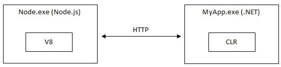
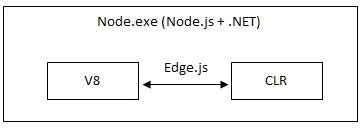
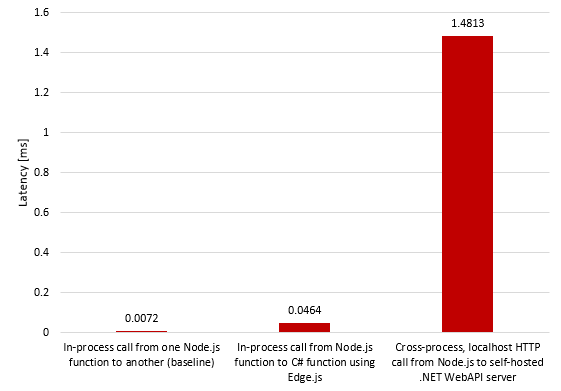
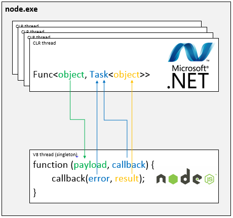

---

marp: true

---

### Living on the Edge-js

Run Node.js and .NET code in one process on Windows, MacOS, and Linux   
  
- Not to be confused with EdgeJS which is a Web framework based on AdonisJS  
(naming things is hard)

---

### About Me

Ken Hill : flipthetrain  

Software Engineer, Architect, Lead, Manager, 30+ years
Cobol, Fortran, MarkIV, Visual Basic, C++, Java, C#, Javascript, Node.js, Python, Ruby

: https://github.com/flipthetrain
: https://www.linkedin.com/in/ken-e-hill  

---

### About Edge-js

#### Created By

blog : https://tomasz.janczuk.org
 : https://github.com/tjanczuk  

Tomasz Janczuk is a software engineer at Microsoft.  His current focus is node.js and Windows Azure.  Before that he worked on .NET Framework and web services.  In his free time he engages in a lot of outdoor activities in the Pacific Northwest and beyond.  You can follow him on Twitter, @tjanczuk, check out his GitHub page or read his blog for more information.

---

### About Edge-js

#### Currently Maintained By
 : https://github.com/agracio/  

---

### Features of Edge-js

- Call .NET functions from Node.js
- Call Node.js functions from .NET
- Languag support : C#, F#, Python, PowerShell
- Automatic marshalling of data between Node and .NET
- Supports Code or Pre-Compiled
- Compile CLR at runtime
- Extensible to other CLR or DSL languages

---

# Why use Edge-js
### HTTP  
 
### In Process  
  

---

# Why use Edge-js
### Performance


---

### Dot Net Flow

  

---

# Calling C# from Node

---

### Installing Edge-js in Node Project  
    - edge-js : npm install @agracio/edge-js

### Language Support  
    - edge-cs : npm install @agracio/edge-cs - * you get this one for free with edge-js *
    - edge-sql : npm install @agracio/edge-sql
    - edge-fs : npm install @agracio/edge-fs
    - edge-ps : npm install @agracio/edge-ps
    - edge-py : npm install @agracio/edge-py
    - edge-iron-py : npm install @agracio/edge-iron-py
    - edge-lsharp : npm install @agracio/edge-lsharp

---

### Using edge-js with a callback (as a function)
```
var edge = require('@agracio/edge-js/lib/edge');
var myEdgeFunc = edge.func('cs | sql | fs | ps | py | iron-py | lsharp',function ()  
    {
        /*
            // function or class declaration
            // destructure input
            // code
            // return result (must be a serializable object)
        */
    }  
);
myEdgeFunc(
	input, 
	function (error, result) {
		if (error) throw error;
		callBackFunction(result);
	}
);

```

---

### Using edge-js with a callback (as a string)
```
var edge = require('@agracio/edge-js/lib/edge');
var myEdgeFunc = edge.func('cs | sql | fs | ps | py | iron-py | lsharp',
`
    // function or class declaration
    // destructure input
    // code
    // return result (must be a serializable object)
`  
);
myEdgeFunc(
	input, 
	function (error, result) {
		if (error) throw error;
		callBackFunction(result);
	}
);

```

---

### Using edge-js with a callback (as a file)
```
var edge = require('@agracio/edge-js/lib/edge');
var myEdgeFunc = edge.func('cs | sql | fs | ps | py | iron-py | lsharp','file name');
myEdgeFunc(
	input, 
	function (error, result) {
		if (error) throw error;
		callBackFunction(result);
	}
);

```

---

### Using edge-js without a callback (as a function)
```
var edge = require('@agracio/edge-js/lib/edge');
var myEdgeFunc = edge.func('cs | sql | fs | ps | py | iron-py | lsharp',function ()  
    {
        /*
            // function or class declaration
            // destructure input
            // code
            // return result (must be a serializable object)
        */
    }  
);
var result=myEdgeFunc(  
    input,  
    true  
);
// use result value here
```

---

### Using edge-js without a callback (as a string)
```
var edge = require('@agracio/edge-js/lib/edge');
var myEdgeFunc = edge.func('cs | sql | fs | ps | py | iron-py | lsharp',
`
    // function or class declaration
    // destructure input
    // code
    // return result (must be a serializable object)
`
);
var result=myEdgeFunc(  
    input,  
    true  
);
// use result value here
```

---

### Using edge-js without a callback (as a file)
```
var edge = require('@agracio/edge-js/lib/edge');
var myEdgeFunc = edge.func('cs | sql | fs | ps | py | iron-py | lsharp','file path);
var result=myEdgeFunc(  
    input,  
    true  
);
// use result value here
```

---

### Using .NET Core

Edge will use .NET Framework 4.7 by default unless told otherwise.

Set EDGE_USE_CORECLR environment variable prior to importing edge-js  
```
process.env.EDGE_USE_CORECLR="1"
```

---

### Marshalling data

Edge marshalls objects to/from .NET as Dynamic ExpandoObjects  
Dynamic ExpandoObjects are essentially ICollection<KeyValuePair<String,Object>>
Which can be cast to/from Dictionary<String,Object>
[ExpandoObject](https://learn.microsoft.com/en-us/dotnet/api/system.dynamic.expandoobject?view=net-8.0)  

Do not send/receive non-serializable object (e.g. Tasks)

---

### Using Async 

Edge will respect .NET async so if you return an async function from .NET you must use async in Node.  

If you return a sync function from .NET you must use sync in Node.  

Calling .NET async from Node sync or calling .NET sync from Node async will fail.

---

### Threads 

Node is essentially a single threaded process with a message queue so you can not marshall threads to/from Node and .NET
You may use threads within .NET but you MUST MANAGE ALL THREAD COMPLETION before returning back to Edge.

---

### Debugging C# 

Edge will emmit debug symbols so you can use Visual Studio Debugger.  
You must attach the running Node process.

Set EDGE_CS_DEBUG environment variable prior to importing edge-js  
```
process.env.EDGE_CS_DEBUG="1"
```

--- 

### Basic structure of calling C# lambda function function from Node
```
// require prebuilt edge binary library (may be import too)
var edge = require('./lib/edge');

// declare edge function
var myFunction = edge.func('cs',function () 
    {
        // script c# code inside a javascript comment block
        // in es6 you can use template strings (back-tick),
        // but we will use comments here
        /*
            async (dynamic input) => 
            { 
                // destructure input
                // code
                // return result (must be a serializable object)
                // do not return a task or any other proprietary .NET object
            }
        */
    }
);

// declare function input
let input={
    // input object
};

// call edge function from javascript
myFunction(
    //input object
	input, 
    //error function
    function (error, result) {
	if (error) throw error;
	console.log(result);
});
```

---

### Example #01 (Script CLR from Node)

Simple Hello function  
- example01.js  
  
Input is a simple value type 
(or a string which in .NET is a funky reference type that behaves like a value type)

---

### Example #02 (Script CLR from Node)

A Hello function with a more complex input  
- example02.js  
  
Input is a reference type  

---

### Basic structure of calling C# class function function in Node
```
// require prebuilt edge binary library (may be import too)
var edge = require('./lib/edge');

// declare edge function
var myFunction = edge.func('cs',function () 
    {
        // script c# code inside a javascript comment block
        // common imports are easily imported
        using System;
        using System.Threading.Tasks 

        public class Startup
        {
            public async Task<object> Invoke(dynamic input)
            {
                // destructure input as input.prop1, input.prop2, ..., input.propn
                // code
                // return results
            }
        }

        //define other classes here
    }
);

// declare function input
let input={
    // input object
};

// call edge function from javascript
myFunction(
    //input object
	input, 
    //error function
    function (error, result) {
	if (error) throw error;
	console.log(result);
});

```

---

### Example #03 (Script CLR from Node)

Importing common packages  
A Startup class and a Hello class   
- example03.js  
  
Edge requires a Startup class with a function named Invoke 

---

### Example #04 (Script CLR from Node)

Importing code file  
- example04.js  
  
---

### Example #05 (Script CLR from Node)

Importing pre-compiled .Dlls  
- example05.js  
  
---

### Example #06 (Script CLR from Node)

Importing Nuget .Dlls  
- example06.js  
  
---

### Example #07 (Script CLR from Node)

Marshalling Functions  
- example07.js  
  
This currently only works in .NET Framework 4.7 so you can not set EDGE_USE_CORECLR environment variable.
---

# Calling Node from C#

---


